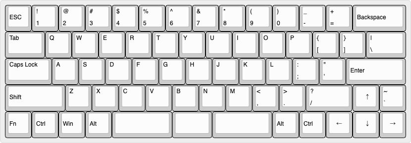

# Order66

66 Keys full size keyboard

- 66 keys
- Cherry MX/Kailh Choc/Kailh Choc V2 key switch compatible
- USB type-C (USB2.0) interface
- On-Board CPU(ATmega32U4)

## Layout

Designed in [Keyboard-layout-editor.com](http://www.keyboard-layout-editor.com).

## License

MIT License

## Author

[toms74209200](<https://github.com/toms74209200>)
